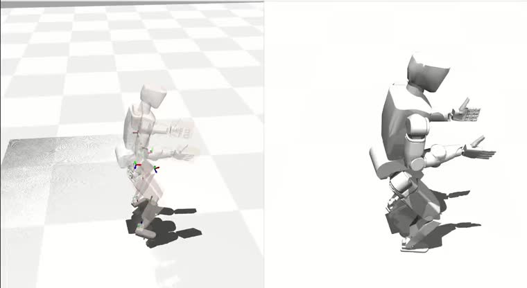
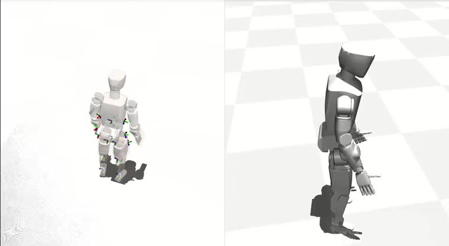
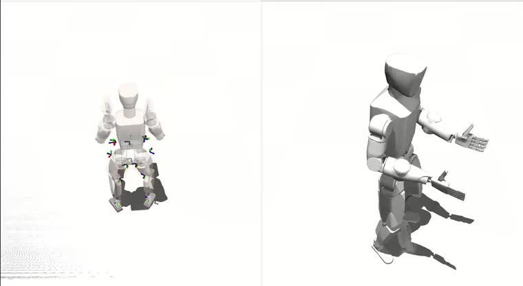
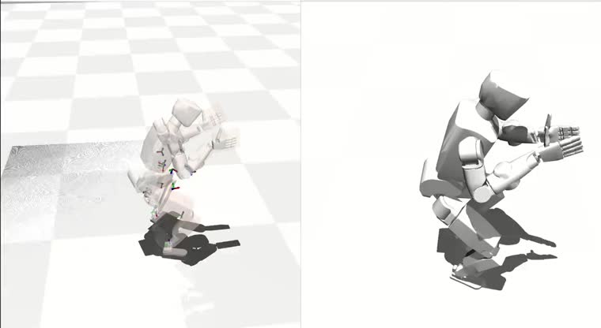
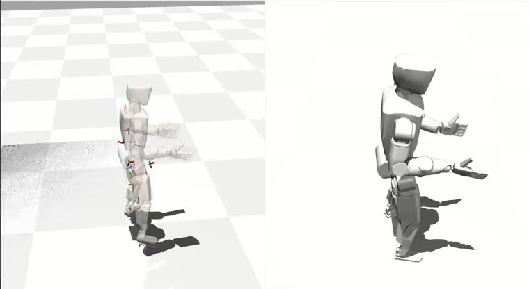

# Whole-Body Motion-Tracking RL — Porting a Humanoid Policy to New Hardware

Training a **29-DoF whole-body motion-tracking policy** for a humanoid robot with IsaacGym RL,
then validating it in sim2sim before real deployment. This repository documents the
**engineering and the debugging** behind getting a pipeline that was proven on a Unitree G1 to
work on a different 29-DoF humanoid — the dataset construction, the training setup, and the
hard-won fixes that actually decided whether the policy learned anything.

> **Scope of this repository.** A portfolio account of the engineering, built on the open
> **TWIST2** framework ([arXiv 2511.02832](https://arxiv.org/abs/2511.02832)). It documents
> *method and lessons*. Two alternative-reward baseline policies (`C1`, `C2`) are included under
> [`onnx/`](onnx/) as runnable examples; the adopted policy's weights, the robot's proprietary
> assets, and the exact
> production data recipe are **not** included (this is commissioned work — see
> [What is not included](#what-is-not-included)).
> The deployment side (real-robot server, sim2sim-over-DDS) is a separate repository.

---

## What this covers

A validated whole-body-tracking RL pipeline existed for the Unitree G1. The task was to bring
it to a different 29-DoF humanoid and produce a policy good enough to deploy. End to end:

1. **Pilot on G1** — reproduce a teacher→student whole-body-tracking pipeline on G1 to confirm
   the method and the sim2sim gate before touching new hardware.
2. **Port to the new robot** — 29-DoF freeze, joint-order/limit reconciliation across URDF ↔
   MJCF, environment + mimic config, and a pkl motion converter.
3. **Build the motion dataset** — retarget public motion (AMASS, OMOMO) and combine it with
   self-captured VR teleoperation motion; curate out bad clips (self-collision, foot-sliding,
   waist-twist); fill the key-body targets.
4. **Train** — IsaacGym (legged_gym / rsl_rl), export to ONNX.
5. **Gate** — a sim2sim parity check (no-fall standing, turning-gait tracking, dynamic
   transitions) decides which policy is allowed near hardware.

## Engineering insights (the interesting part)

The pipeline was the easy half. These are the problems that actually gated progress —
write-ups in [`docs/INSIGHTS.md`](docs/INSIGHTS.md):

- **A silent double-rotation bug** in the key-body target generation that made the policy
  unable to learn key-body tracking — diagnosed from a reward curve that was flat from iteration 0.
- **Cross-version pickle incompatibility** (`numpy 2` save ↔ `numpy 1.23` load) that broke the
  dataset loader, fixed by a re-serialization pass.
- **A plausible-but-wrong hypothesis, disproved by measurement** (ground-contact "chatter"
  blamed on a stiff floor `solref`; a controlled A/B showed it was not the cause).
- **Standing-pose augmentation** to cure idle jitter the policy never learned.

The work ended with **five trained policy variants** from a controlled, one-variable-at-a-time
study (the adopted one passed the sim2sim gate); the design, the variants, and why training
loss was *not* the selection criterion are in [`docs/EXPERIMENTS.md`](docs/EXPERIMENTS.md).

See also [`docs/DATA_PIPELINE.md`](docs/DATA_PIPELINE.md) (dataset construction & curation) and
[`docs/POLICY_IO.md`](docs/POLICY_IO.md) (the observation/action contract, so the work is
legible without the weights).

## Demo — policy behavior (sim2sim)

Each trained variant runs the same reference motion in the IGRIS-C MuJoCo model, shown as a
side-by-side sim2sim view. The adopted, deployed policy is **A3**. **Click a thumbnail to play
(YouTube).**

**A3 — waist + hip emphasis · adopted, passed the sim2sim gate**

| | |
|---|---|
|  **A1** — hip-weight emphasis |  **A2** — waist-weight emphasis |
|  **C1** — alt-reward, longer distillation |  **C2** — alt-reward, shorter (fell on the turning gait) |

## Tech stack

IsaacGym · legged_gym / rsl_rl · PyTorch (training) · ONNX (export) · MuJoCo (sim2sim) ·
Redis · GMR (retargeting) · PICO / XRoboToolkit (VR capture)

## What is not included

This is commissioned work; proprietary and bulky artifacts are referenced or withheld:

| not included | reason |
|---|---|
| Adopted & A-series policy weights | research deliverable / IP — the two alt-reward baselines (`C1`, `C2`) *are* included under `onnx/`; interface in `docs/POLICY_IO.md` |
| Robot URDF / MJCF / meshes | manufacturer/team assets — not redistributed here |
| Exact production data recipe | the precise public-vs-VR mix ratio is proprietary; only the *principle* is described |
| Internal infrastructure | remote GPU hosts, addresses, credentials — excluded |
| Motion datasets / checkpoints | large; AMASS/OMOMO are obtained from their own sources |

## Credits

Base framework: **TWIST2** (open), used as the starting training pipeline. The policies here
were trained from scratch on a project-specific dataset.
IsaacGym, GMR, AMASS, and OMOMO are the respective projects' work.

## License

Released under the **PolyForm Noncommercial License 1.0.0** — free to use, modify, and share for
noncommercial purposes; commercial use is not permitted. See [LICENSE](LICENSE). This covers only
the original documentation in this repository; it grants no rights to the robot's proprietary
assets, which are not included here.
